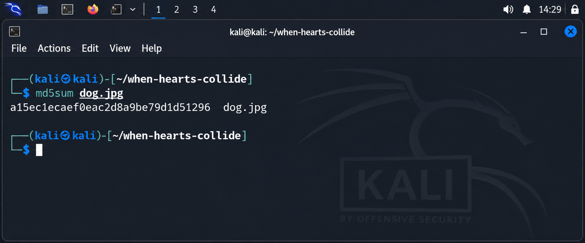
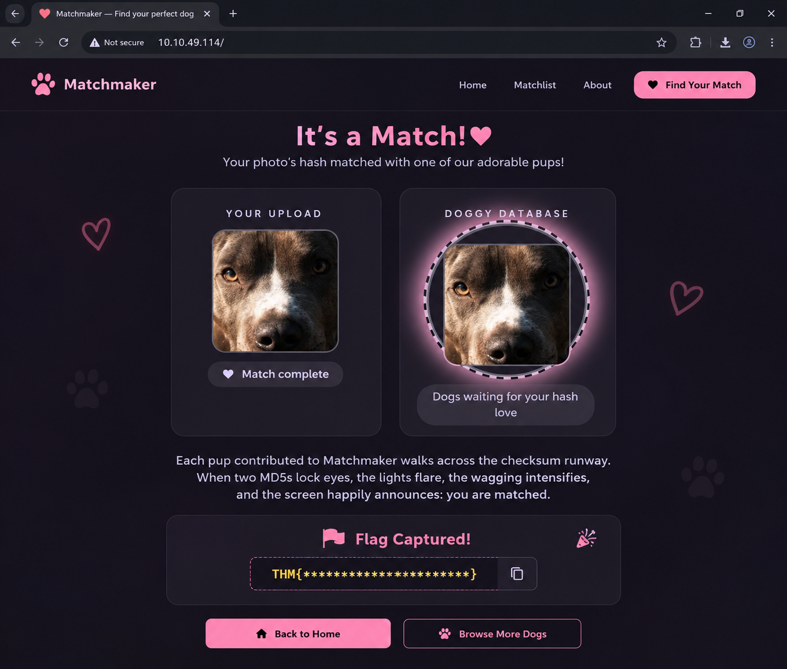

# 🐶 When Hearts Collide — TryHackMe Walkthrough

<p align="center">
  
  
  
  
</p>

<p align="center">
  <strong>Professional cybersecurity documentation of the TryHackMe Web Security challenge “When Hearts Collide”.</strong><br>
  A complete technical walkthrough covering reconnaissance, exploitation, cryptographic analysis, security impact, mitigation strategies, and portfolio-ready documentation.
</p>

---

## 📖 About This Repository

This repository contains a **professional technical walkthrough** for the **When Hearts Collide** room on **TryHackMe**.

The challenge demonstrates a practical exploitation of an application that relies on the **MD5 hashing algorithm** to identify uploaded files. Since MD5 is cryptographically broken and vulnerable to **collision attacks**, the application can be tricked into accepting a maliciously crafted image that produces the same MD5 digest as a legitimate image.

Instead of simply solving the challenge, this repository documents the **entire penetration testing methodology**, making it suitable for a cybersecurity portfolio.

> **Note:** The challenge flag has been intentionally **redacted** throughout this repository to preserve TryHackMe challenge integrity and prevent plagiarism.

---

# 🎯 Challenge Overview

<table>
<tr><td><strong>Platform</strong></td><td>TryHackMe</td></tr>
<tr><td><strong>Room</strong></td><td>When Hearts Collide</td></tr>
<tr><td><strong>Category</strong></td><td>Web Security / Cryptography</td></tr>
<tr><td><strong>Difficulty</strong></td><td>Easy</td></tr>
<tr><td><strong>Vulnerability</strong></td><td>MD5 Hash Collision</td></tr>
<tr><td><strong>Attack Technique</strong></td><td>Collision-based File Upload Bypass</td></tr>
<tr><td><strong>Primary Tool</strong></td><td>fastcoll</td></tr>
<tr><td><strong>Operating System</strong></td><td>Kali Linux</td></tr>
</table>

---

# 🧠 Skills Demonstrated

- Web Application Reconnaissance
- Static Resource Enumeration
- Linux Command-Line Operations
- Cryptographic Hash Analysis
- MD5 Collision Exploitation
- File Upload Testing
- Vulnerability Validation
- Security Impact Assessment
- Secure Hashing Best Practices
- Professional Security Documentation

---

# 🗺️ Attack Methodology

The exploitation workflow followed during this challenge.

```text
Target Web Application
          │
          ▼
Reconnaissance
          │
          ▼
Static Asset Discovery
          │
          ▼
Download Reference Image
          │
          ▼
Calculate MD5 Digest
          │
          ▼
Generate MD5 Collision
          │
          ▼
Verify Matching Hashes
          │
          ▼
Upload Collision Image
          │
          ▼
Application Accepts Match
          │
          ▼
Flag Captured (Redacted)
```

---

# 📸 Walkthrough Preview

## Step 1 — Homepage Reconnaissance

The application provides a dog matching interface where users upload an image that is compared against stored dog images using MD5 hashes.

<p align="center">

</p>

---

## Step 2 — Discover the Reference Image

The application exposes a publicly accessible dog image through its static upload directory.

<p align="center">

</p>

---

## Step 3 — Download the Target Image

The image is downloaded locally for analysis.

```bash
wget http://TARGET_IP/static/uploads/<image>.jpg -O dog.jpg
```

Verify the download:

```bash
ls -la dog.jpg
```

<p align="center">

</p>

---

## Step 4 — Calculate the MD5 Hash

The vulnerable application relies entirely on this digest.

```bash
md5sum dog.jpg
```

<p align="center">

</p>

---

## Step 5 — Generate MD5 Collision Files

The **fastcoll** utility generates two different files sharing the same MD5 hash.

```bash
sudo apt update
sudo apt install fastcoll -y

fastcoll --prefixfile dog.jpg \
  -o collision1.jpg collision2.jpg
```

Verify hashes:

```bash
md5sum dog.jpg collision1.jpg collision2.jpg
```

<p align="center">

</p>

---

## Step 6 — Upload Collision Image

Uploading one of the collision images successfully bypasses the application's matching logic.

---

## Step 7 — Challenge Completed

The application reveals the challenge flag.

> 🔒 **Flag intentionally hidden**

```text
THM{********************}
```

<p align="center">

</p>

---

# 🔍 Technical Analysis

## Root Cause

The application compares uploaded images using only the MD5 digest.

```text
Uploaded Image
      │
      ▼
Calculate MD5
      │
      ▼
Compare Against Stored MD5
      │
      ├── Match → Same Image (Incorrect Assumption)
      └── No Match
```

The vulnerability exists because **MD5 collisions are practical**.

### Incorrect Security Assumption

```text
Same MD5 Hash
      ↓
Same File
```

This assumption is false for MD5.

---

# 💥 Security Impact

Using MD5 for file identity verification may allow:

| Risk | Description |
|------|-------------|
| File Impersonation | Different files appear identical to the application. |
| Verification Bypass | Upload restrictions relying on MD5 can be bypassed. |
| Integrity Failure | Hash equality does not guarantee identical content. |
| Application Logic Abuse | Hash-based lookups become unreliable. |

---

# 🛡️ Mitigation Recommendations

Modern applications should avoid MD5 for security-sensitive operations.

### Recommended Improvements

- Replace **MD5** with **SHA-256** or **SHA-3**.
- Validate MIME type and file signatures.
- Verify magic bytes.
- Compare actual file contents where appropriate.
- Use **HMAC** when authenticity is required.
- Implement layered server-side validation.

---

# 🧰 Tools Used

| Tool | Purpose |
|------|---------|
| Kali Linux | Testing environment |
| wget | Download exposed resources |
| md5sum | Calculate hashes |
| fastcoll | Generate MD5 collision files |
| Browser DevTools | Inspect application resources |
| TryHackMe | Authorized lab environment |

---

# 📂 Repository Structure

```text
When-Hearts-Collide-TryHackMe-Walkthrough
│
├── README.md
├── Documentation/
│   ├── Documentation.md
│   └── Documentation.docx
│
├── Resources/
│   └── notes.md
│
├── Screenshots/
│   ├── figure-1-homepage.png
│   ├── figure-2-dog-image.png
│   ├── figure-3-download.png
│   ├── figure-4-md5sum.png
│   ├── figure-5-collision.png
│   └── figure-6-flag-redacted.png
│
├── docs/
│   └── index.md
│
└── _config.yml
```

---

# 📚 Documentation

This repository includes multiple forms of documentation.

| File | Description |
|------|-------------|
| `README.md` | Repository overview and challenge summary. |
| `Documentation/Documentation.md` | Complete technical walkthrough with screenshots. |
| `Documentation/Documentation.docx` | Portfolio-ready Word report. |
| `docs/index.md` | GitHub Pages documentation homepage. |
| `Resources/notes.md` | Supplementary notes and references. |

---

# 📸 Evidence Gallery

| Screenshot | Description |
|------------|-------------|
| `figure-1-homepage.png` | Application landing page. |
| `figure-2-dog-image.png` | Publicly accessible reference image. |
| `figure-3-download.png` | Download verification. |
| `figure-4-md5sum.png` | MD5 hash calculation. |
| `figure-5-collision.png` | Successful collision generation. |
| `figure-6-flag-redacted.png` | Challenge completion (flag hidden). |

---

# 🎓 Learning Outcomes

After completing this room, I gained practical understanding of:

- Why MD5 is considered cryptographically broken.
- Practical collision attacks using `fastcoll`.
- Hash-based file matching vulnerabilities.
- Static asset enumeration in web applications.
- Secure alternatives to MD5 in production systems.
- Writing professional penetration testing documentation.

---

# ⚠️ Disclaimer

This repository documents work completed in an **authorized TryHackMe Capture The Flag (CTF) environment** for educational and cybersecurity research purposes.

The techniques discussed here should **only** be used against systems you own or have explicit authorization to test.

---

# 👨‍💻 Author

**Anurag Ravikumar**

Cybersecurity Enthusiast • SOC & Blue Team Learner • TryHackMe Practitioner • GitHub Portfolio Builder

> Building a practical cybersecurity portfolio through hands-on labs, CTF walkthroughs, security tools, and technical documentation.

---

<p align="center">
  ⭐ If you found this repository helpful, consider starring it.
</p>
