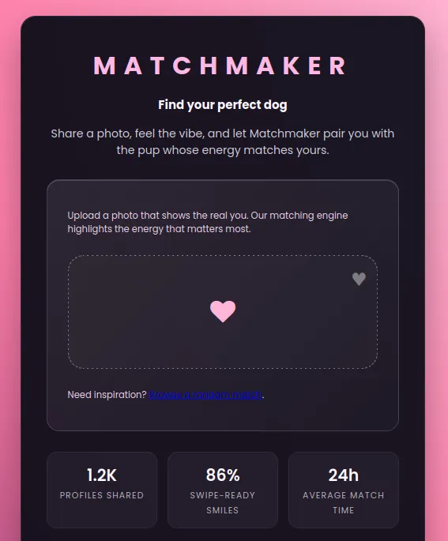
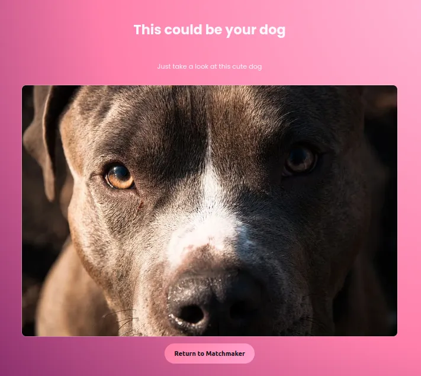
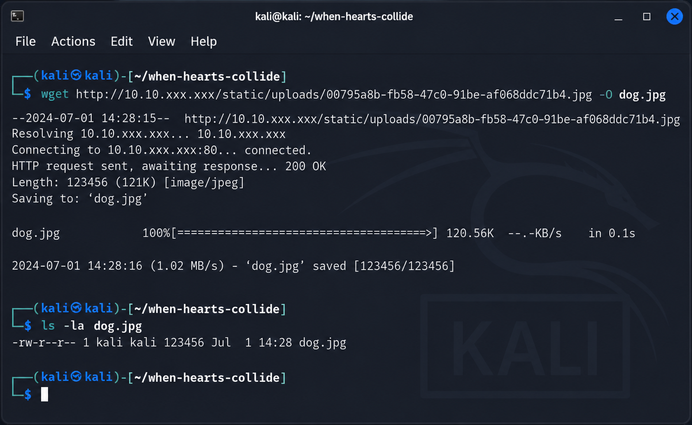
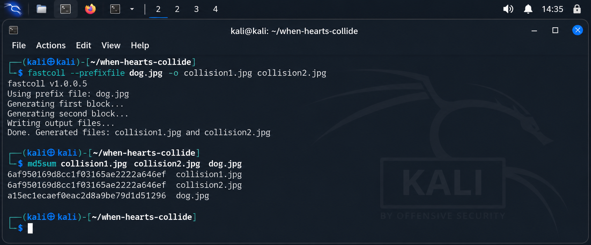

<div align="center">

# 🐶 Love at First Breach

### TryHackMe Web Security CTF Walkthrough

<p>
  
  
  
  
</p>

<p>
  <strong>A practical web security case study demonstrating how insecure MD5-based file verification can be bypassed using a collision attack.</strong>
</p>

</div>

---

## 📌 About This Walkthrough

This page documents my complete solution methodology for the **Love at First Breach** challenge on **TryHackMe**.

The challenge presents a simple dog-matching web application called **Matchmaker**. Users upload an image, and the application attempts to identify a matching dog by comparing the uploaded file's **MD5 hash** against stored hashes.

The vulnerability is caused by treating an MD5 hash match as proof that two files are identical.

Because MD5 is **not collision resistant**, two different files can be crafted to produce the same digest. This allows an attacker to create a collision file that satisfies the application's matching logic.

> 🔒 **Flag Policy:** The challenge flag is intentionally redacted throughout this portfolio documentation.

---

# 🎯 Challenge Profile

| Property | Details |
|---|---|
| **Platform** | TryHackMe |
| **Challenge** | Love at First Breach |
| **Theme** | Matchmaker / Dog Image Matching |
| **Category** | Web Security / Cryptography |
| **Primary Vulnerability** | MD5 Hash Collision |
| **Attack Vector** | File Upload Verification Bypass |
| **Primary Tool** | `fastcoll` |
| **Environment** | Kali Linux |
| **Result** | Successfully completed |

---

# 🧠 What This Challenge Demonstrates

This CTF combines several practical security concepts:

- Web application reconnaissance
- Static asset enumeration
- Public file discovery
- Hash analysis
- MD5 collision attacks
- File upload testing
- Cryptographic weakness identification
- Security impact analysis
- Defensive remediation

---

# 🗺️ Attack Chain

```text
┌──────────────────────────┐
│   Matchmaker Web App     │
└────────────┬─────────────┘
             │
             ▼
┌──────────────────────────┐
│  Initial Reconnaissance  │
└────────────┬─────────────┘
             │
             ▼
┌──────────────────────────┐
│ Discover Public Image    │
└────────────┬─────────────┘
             │
             ▼
┌──────────────────────────┐
│ Download Reference File  │
└────────────┬─────────────┘
             │
             ▼
┌──────────────────────────┐
│ Calculate MD5 Hash       │
└────────────┬─────────────┘
             │
             ▼
┌──────────────────────────┐
│ Generate MD5 Collision   │
│        using fastcoll    │
└────────────┬─────────────┘
             │
             ▼
┌──────────────────────────┐
│ Verify Collision Output  │
└────────────┬─────────────┘
             │
             ▼
┌──────────────────────────┐
│ Upload Collision Image   │
└────────────┬─────────────┘
             │
             ▼
┌──────────────────────────┐
│ Successful Match         │
└────────────┬─────────────┘
             │
             ▼
┌──────────────────────────┐
│ Flag Captured            │
│      (Redacted)          │
└──────────────────────────┘
```

---

# 🔎 Phase 1 — Reconnaissance

The first step was to inspect the target web application and understand its functionality.

The landing page exposes an image upload mechanism and a featured breed/match-list feature.

These components immediately identify the application's image-processing workflow as the primary attack surface.

## Figure 1 — Matchmaker Homepage

<p align="center">
  
</p>

<p align="center">
  <em>Figure 1 — Initial reconnaissance of the Matchmaker web application.</em>
</p>

### Initial Observations

| Observation | Security Relevance |
|---|---|
| Image upload functionality | User-controlled file enters application processing. |
| Featured breed section | Potential source of application-managed images. |
| Static resources | May reveal predictable file locations. |
| Public interface | Initial interaction does not require authentication. |

The key objective at this stage was not exploitation, but identifying a trusted image that could later be analyzed.

---

# 📂 Phase 2 — Static Resource Discovery

Inspecting the application's resources revealed that dog images are served from a predictable static upload location.

Example:

```text
/static/uploads/<image-id>.jpg
```

A publicly accessible reference image was identified and retrieved for offline analysis.

## Figure 2 — Discovered Reference Image

<p align="center">
  
</p>

<p align="center">
  <em>Figure 2 — Reference dog image discovered through the application's exposed static resources.</em>
</p>

### Why This Was Important

The application already trusts this image as part of its matching database.

Obtaining it provides the reference input needed to reproduce the application's hash-based verification process locally.

---

# 💾 Phase 3 — Download the Reference Image

The reference file was downloaded from the target using `wget`.

```bash
wget http://TARGET_IP/static/uploads/<image-id>.jpg -O dog.jpg
```

The local file was then verified:

```bash
ls -la dog.jpg
```

## Figure 3 — Download Verification

<p align="center">
  
</p>

<p align="center">
  <em>Figure 3 — Downloading the reference image and verifying its presence in the Kali Linux working directory.</em>
</p>

### Result

The reference image was successfully obtained and became the input for the cryptographic analysis phase.

---

# 🔐 Phase 4 — MD5 Hash Analysis

The next step was to calculate the MD5 digest of the reference image.

```bash
md5sum dog.jpg
```

## Figure 4 — MD5 Digest Calculation

<p align="center">
  
</p>

<p align="center">
  <em>Figure 4 — Calculating the MD5 digest of the reference image using <code>md5sum</code>.</em>
</p>

## Why MD5 Is the Vulnerability

MD5 produces a 128-bit digest and was historically used for integrity and identification purposes.

However, MD5 is no longer considered collision resistant.

The important distinction is:

```text
Same File
   ↓
Same MD5
```

is expected,

but:

```text
Same MD5
   ↓
Same File
```

is **not guaranteed**.

An attacker can deliberately construct different data with the same MD5 digest.

That is the exact weakness exploited by this challenge.

---

# 🧪 Phase 5 — Generate an MD5 Collision

The collision-generation stage uses `fastcoll`.

Install the tool:

```bash
sudo apt update
sudo apt install fastcoll -y
```

Verify:

```bash
fastcoll -h
```

The collision files were then generated using:

```bash
fastcoll --prefixfile dog.jpg -o collision1.jpg collision2.jpg
```

The outputs were checked using:

```bash
md5sum dog.jpg collision1.jpg collision2.jpg
```

## Figure 5 — Collision Generation and Verification

<p align="center">
  
</p>

<p align="center">
  <em>Figure 5 — Generating collision files with <code>fastcoll</code> and validating their MD5 digests.</em>
</p>

### Result

The collision generation stage produced files capable of satisfying the application's MD5-based matching condition.

The important security finding is not the specific hash value, but the fact that **MD5 equality can be intentionally manufactured for different file contents**.

---

# 🚀 Phase 6 — Upload the Collision Image

With the collision image prepared, the next step was to return to the Matchmaker application.

One of the generated files was uploaded through the application's image upload interface.

The vulnerable workflow can be represented as:

```text
Collision Image
      │
      ▼
Server Receives File
      │
      ▼
MD5 Calculation
      │
      ▼
Compare With Stored Digest
      │
      ▼
Digest Matches
      │
      ▼
Application Treats Upload
As Trusted Match
```

The application does not establish file identity through robust content validation.

Instead, it relies on the MD5 digest to make the matching decision.

---

# ✅ Phase 7 — Successful Match

The application accepted the uploaded collision file and returned the successful match response.

This confirms that the MD5 collision successfully satisfied the application's verification logic.

## Figure 6 — Challenge Completion

<p align="center">
  
</p>

<p align="center">
  <em>Figure 6 — Successful challenge completion. The flag has been intentionally redacted.</em>
</p>

### Flag

```text
THM{********************}
```

> The original flag is intentionally omitted from this portfolio walkthrough.

---

# 🔬 Technical Root Cause

The core vulnerability can be reduced to a simple trust decision:

```python
if md5(uploaded_file) == stored_md5:
    accept_match()
```

The application assumes:

```text
MD5 Match
    ↓
Same File
    ↓
Trusted Content
```

The security flaw is the first assumption.

A collision attack breaks the relationship between:

```text
Hash Equality
```

and

```text
Content Equality
```

Therefore, an attacker-controlled file can satisfy the same verification condition as a trusted file.

---

# 💥 Security Impact

The impact of this vulnerability depends on how the same verification design is used in real applications.

Potential consequences include:

| Impact | Description |
|---|---|
| **File Impersonation** | Different content can be represented by the same MD5 digest. |
| **Integrity Failure** | Hash equality cannot reliably establish content integrity. |
| **Verification Bypass** | Security decisions based solely on MD5 become unreliable. |
| **Business Logic Abuse** | Application behavior can be manipulated through crafted input. |

The primary security concern demonstrated by this room is **integrity and trust failure**.

---

# 🛡️ Remediation

A production application should not rely on MD5 for security-sensitive identity or integrity decisions.

## Recommended Improvements

### 1. Replace MD5

Use modern collision-resistant algorithms where hashing is appropriate:

- SHA-256
- SHA-3
- BLAKE2 / BLAKE3 where appropriate

### 2. Validate Uploaded Files

Perform independent server-side checks:

```text
File Extension
      ↓
MIME Type
      ↓
Magic Bytes
      ↓
File Size
      ↓
Content Validation
```

### 3. Avoid Hash-Only Identity Checks

A hash should not automatically be treated as proof that two attacker-controlled files are identical.

Use trusted database identifiers and controlled object references where applicable.

### 4. Use HMAC When Authenticity Is Required

A server-side secret can provide stronger authenticity guarantees than a publicly computable hash.

### 5. Apply Defense in Depth

Cryptographic verification should be only one part of the application's security model.

---

# 📊 Attack Summary

| Phase | Action | Result |
|---|---|---|
| 01 | Application reconnaissance | Upload functionality identified |
| 02 | Static resource enumeration | Reference image discovered |
| 03 | File acquisition | Image downloaded successfully |
| 04 | Hash analysis | MD5 verification model identified |
| 05 | Collision generation | Collision files created |
| 06 | File upload | Collision accepted |
| 07 | Validation | Successful match / flag captured |

---

# 🧰 Tools Used

| Tool | Purpose |
|---|---|
| **Kali Linux** | Security testing environment |
| **Web Browser** | Web application interaction |
| **wget** | Download reference image |
| **md5sum** | Calculate and compare hashes |
| **fastcoll** | Generate MD5 collision files |
| **TryHackMe** | Authorized CTF environment |

---

# 🎓 Skills Demonstrated

This challenge provided practical experience in:

- Web reconnaissance
- Static asset enumeration
- File upload analysis
- Linux command-line tooling
- Cryptographic hash analysis
- MD5 collision concepts
- Vulnerability validation
- Security impact assessment
- Secure application design
- Technical cybersecurity documentation

---

# 📸 Evidence Overview

The walkthrough is supported by six pieces of visual evidence:

| Figure | Evidence |
|---|---|
| **Figure 1** | Matchmaker homepage and initial reconnaissance |
| **Figure 2** | Discovered reference dog image |
| **Figure 3** | Reference image download |
| **Figure 4** | MD5 digest calculation |
| **Figure 5** | Collision generation and verification |
| **Figure 6** | Successful match and redacted flag |

All evidence is stored under:

```text
docs/assets/
```

---

# 🧩 What I Learned

This challenge reinforced several practical security principles.

### Cryptographic Weaknesses Can Become Application Vulnerabilities

A cryptographic primitive does not need to be directly "cracked" to create a vulnerability.

Incorrectly trusting a weak primitive can be enough to compromise application logic.

### Reconnaissance Often Reveals the Attack Path

The vulnerability became much easier to exploit after discovering the application's publicly accessible reference image.

### Verification Must Consider the Threat Model

If an attacker controls the input, a security mechanism must be designed with deliberate manipulation in mind.

---

# 🏁 Conclusion

**Love at First Breach** is a compact but valuable demonstration of how cryptographic weaknesses can directly affect web application security.

The complete attack path consisted of:

```text
Reconnaissance
     ↓
Reference File Discovery
     ↓
MD5 Analysis
     ↓
Collision Generation
     ↓
Collision Upload
     ↓
Successful Verification
     ↓
Challenge Completion
```

The central lesson is straightforward:

> **MD5 should not be used as a security-sensitive mechanism for establishing file identity or authenticity.**

The challenge successfully demonstrated how a collision-resistant security assumption can fail when an outdated hashing algorithm is placed at the center of an application's trust decision.

---

# 📚 Full Technical Report

For the complete detailed documentation, including the full methodology, technical analysis, evidence references, root-cause analysis, and mitigation discussion, see:

**[📄 Love at First Breach — Full Documentation](../Documentation/Love%20at%20First%20Breach_Documentation.md)**

---

# ⚠️ Disclaimer

This walkthrough documents activities performed inside an **authorized TryHackMe CTF/laboratory environment** for cybersecurity education and research.

The techniques described should only be used against systems that you own or have explicit permission to assess.

---

<div align="center">

## 👨‍💻 Author

### Anurag Ravikumar

**Cybersecurity Enthusiast • Web Security • SOC • Blue Team • Cryptography**

---

<p>
  <sub>CTF completed • Evidence documented • Flag intentionally redacted</sub>
</p>

</div>
