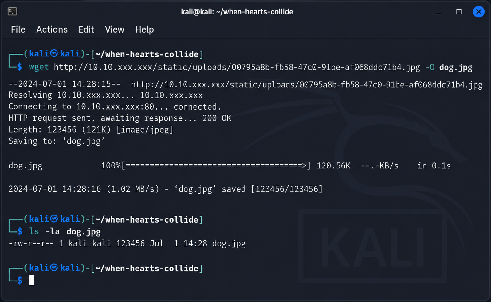
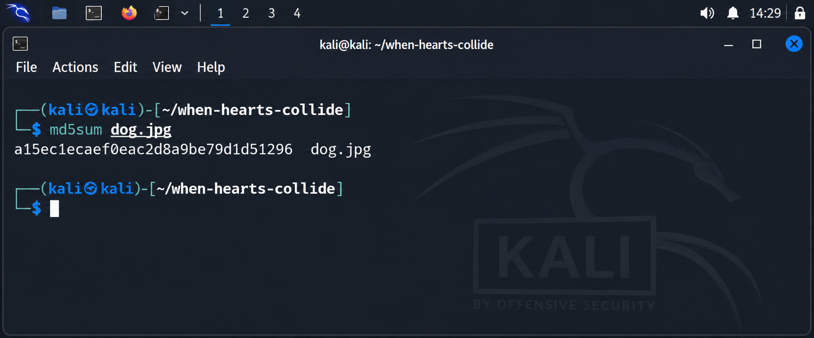
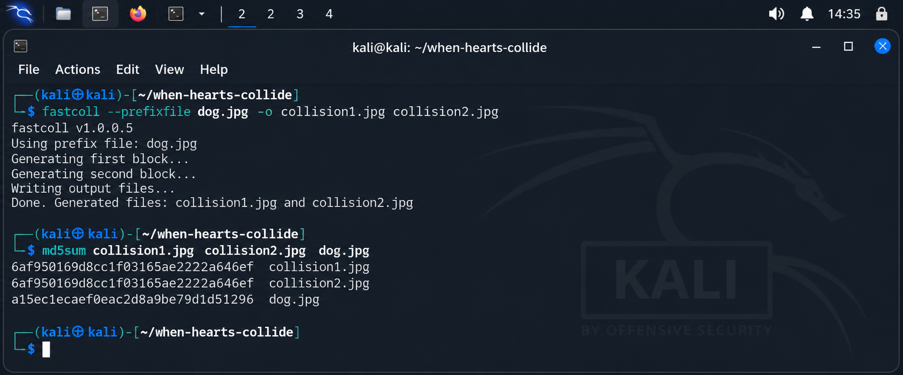
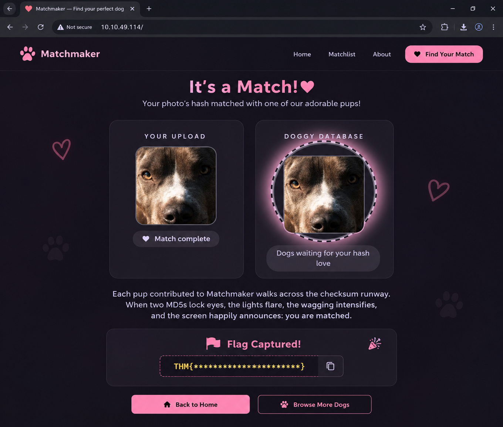

<div class="ctf-hero">

  <h1>Love at First Breach</h1>

  <p>
    A practical web security case study demonstrating how insecure MD5-based
    file verification can be bypassed using a collision attack.
  </p>

  <div class="ctf-badges">

    <span class="ctf-badge">TryHackMe</span>
    <span class="ctf-badge">Web Security</span>
    <span class="ctf-badge">Cryptography</span>
    <span class="ctf-badge">MD5 Collision</span>
    <span class="ctf-badge">Completed</span>

  </div>

</div>

---

## Mission

**Love at First Breach** is a TryHackMe web security challenge centered around a dog-matching application named **Matchmaker**.

The application allows users to upload an image and attempts to identify a matching dog by comparing the uploaded file's **MD5 hash** against stored hashes.

The security weakness is the application's reliance on MD5 equality as evidence that two files are identical. Because MD5 is no longer collision resistant, deliberately crafted files can produce the same digest while containing different data.

The documented attack therefore focuses on:

```text
Reference Image
      ↓
MD5 Analysis
      ↓
Collision Generation
      ↓
Collision Verification
      ↓
Image Upload
      ↓
Successful Match
      ↓
Flag Captured
```

> **Flag Policy:** The challenge flag is intentionally redacted throughout this portfolio documentation.

---

## Challenge Profile

<div class="ctf-card-grid">

  <div class="ctf-card">
    <div class="ctf-card-title">Platform</div>
    <div class="ctf-card-value">TryHackMe</div>
  </div>

  <div class="ctf-card">
    <div class="ctf-card-title">Challenge</div>
    <div class="ctf-card-value">Love at First Breach</div>
  </div>

  <div class="ctf-card">
    <div class="ctf-card-title">Category</div>
    <div class="ctf-card-value">Web Security / Cryptography</div>
  </div>

  <div class="ctf-card">
    <div class="ctf-card-title">Primary Vulnerability</div>
    <div class="ctf-card-value">MD5 Hash Collision</div>
  </div>

  <div class="ctf-card">
    <div class="ctf-card-title">Attack Vector</div>
    <div class="ctf-card-value">File Upload Verification Bypass</div>
  </div>

  <div class="ctf-card">
    <div class="ctf-card-title">Primary Tool</div>
    <div class="ctf-card-value"><code>fastcoll</code></div>
  </div>

  <div class="ctf-card">
    <div class="ctf-card-title">Environment</div>
    <div class="ctf-card-value">Kali Linux</div>
  </div>

  <div class="ctf-card">
    <div class="ctf-card-title">Status</div>
    <div class="ctf-card-value">Successfully Completed</div>
  </div>

</div>

---

## Navigation

<div class="ctf-toc">

<div class="ctf-toc-title">Documentation Map</div>

- [Mission](#mission)
- [Challenge Profile](#challenge-profile)
- [Security Concepts Demonstrated](#security-concepts-demonstrated)
- [Attack Chain](#attack-chain)
- [Reconnaissance](#reconnaissance)
- [Static Resource Discovery](#static-resource-discovery)
- [Reference Image Acquisition](#reference-image-acquisition)
- [MD5 Hash Analysis](#md5-hash-analysis)
- [MD5 Collision Generation](#md5-collision-generation)
- [Collision Upload](#collision-upload)
- [Successful Match](#successful-match)
- [Technical Root Cause](#technical-root-cause)
- [Security Impact](#security-impact)
- [Remediation](#remediation)
- [Attack Summary](#attack-summary)
- [Tools Used](#tools-used)
- [Skills Demonstrated](#skills-demonstrated)
- [Evidence Overview](#evidence-overview)
- [What I Learned](#what-i-learned)
- [Conclusion](#conclusion)
- [Full Technical Report](#full-technical-report)
- [Responsible Use](#responsible-use)

</div>
---

## Security Concepts Demonstrated

This challenge combines several practical security concepts:

- Web application reconnaissance
- Static asset enumeration
- Public file discovery
- Hash analysis
- MD5 collision attacks
- File upload testing
- Cryptographic weakness identification
- Security impact analysis
- Defensive remediation

The exercise demonstrates how a weakness in a cryptographic primitive can become an application-level security issue when the primitive is used as the basis for a trust decision.

---

## Attack Chain

<div class="attack-chain">

  <div class="attack-step">Web Reconnaissance</div>

  <div class="attack-arrow">→</div>

  <div class="attack-step">Reference Image Discovery</div>

  <div class="attack-arrow">→</div>

  <div class="attack-step">MD5 Analysis</div>

  <div class="attack-arrow">→</div>

  <div class="attack-step">Collision Generation</div>

  <div class="attack-arrow">→</div>

  <div class="attack-step">Collision Verification</div>

  <div class="attack-arrow">→</div>

  <div class="attack-step">Upload</div>

  <div class="attack-arrow">→</div>

  <div class="attack-step">Successful Match</div>

</div>

---

# Reconnaissance

The first step was to inspect the target web application and understand its functionality.

The landing page exposes an image upload mechanism and a featured breed/match-list feature.

These components identify the application's image-processing workflow as the primary attack surface.

<figure>

  

  <figcaption>
    Figure 1 — Initial reconnaissance of the Matchmaker web application.
  </figcaption>

</figure>

### Initial Observations

| Observation | Security Relevance |
|---|---|
| Image upload functionality | User-controlled file enters application processing. |
| Featured breed section | Potential source of application-managed images. |
| Static resources | May reveal predictable file locations. |
| Public interface | Initial interaction does not require authentication. |

The objective at this stage was not immediate exploitation. The focus was understanding how the application handled uploaded images and identifying a trusted image that could later be analyzed.

---

# Static Resource Discovery

Inspection of the application's resources revealed that dog images were served from a predictable static upload location.

Example:

```text
/static/uploads/<image-id>.jpg
```

A publicly accessible reference image was identified and retrieved for offline analysis.

<figure>

  

  <figcaption>
    Figure 2 — Reference dog image discovered through the application's exposed static resources.
  </figcaption>

</figure>

### Why the Reference Image Matters

The application already trusts this image as part of its matching database.

Obtaining the reference file provides the input required to reproduce the application's hash-based verification workflow locally.

The discovery therefore connects the initial reconnaissance phase with the later cryptographic analysis.

---

# Reference Image Acquisition

The reference file was downloaded from the target using `wget`.

```bash
wget http://TARGET_IP/static/uploads/<image-id>.jpg -O dog.jpg
```

The downloaded file was then verified locally:

```bash
ls -la dog.jpg
```

<figure>

  

  <figcaption>
    Figure 3 — Downloading the reference image and verifying its presence in the Kali Linux working directory.
  </figcaption>

</figure>

### Result

The reference image was successfully obtained and became the input for the cryptographic analysis phase.

---

# MD5 Hash Analysis

The next step was to calculate the MD5 digest of the reference image.

```bash
md5sum dog.jpg
```

<figure>

  

  <figcaption>
    Figure 4 — Calculating the MD5 digest of the reference image using <code>md5sum</code>.
  </figcaption>

</figure>

## Why MD5 Is the Vulnerability

MD5 produces a 128-bit digest and was historically used for integrity and identification purposes.

However, MD5 is no longer considered collision resistant.

The important distinction is:

```text
Same File
   ↓
Same MD5
```

This relationship is expected.

However:

```text
Same MD5
   ↓
Same File
```

is **not guaranteed**.

An attacker can deliberately construct different data with the same MD5 digest.

That distinction is the core cryptographic weakness demonstrated by this challenge.

---

# MD5 Collision Generation

The collision-generation stage uses `fastcoll`.

The tool was installed with:

```bash
sudo apt update
sudo apt install fastcoll -y
```

Installation was then verified with:

```bash
fastcoll -h
```

The collision files were generated using:

```bash
fastcoll --prefixfile dog.jpg -o collision1.jpg collision2.jpg
```

The resulting files were checked with:

```bash
md5sum dog.jpg collision1.jpg collision2.jpg
```

<figure>

  

  <figcaption>
    Figure 5 — Generating collision files with <code>fastcoll</code> and validating their MD5 digests.
  </figcaption>

</figure>

### Result

The collision-generation stage produced files capable of satisfying the application's documented MD5-based matching condition.

The important security finding is not the specific digest value. It is that **MD5 equality can be deliberately manufactured for different file contents**.

This breaks the assumption that a matching MD5 value is sufficient proof of content identity.

---

# Collision Upload

With the collision image prepared, the next step was to return to the Matchmaker application.

One of the generated files was uploaded through the application's image upload interface.

The vulnerable workflow can be represented as:

<div class="attack-chain">

  <div class="attack-step">Collision Image</div>

  <div class="attack-arrow">→</div>

  <div class="attack-step">Server Receives File</div>

  <div class="attack-arrow">→</div>

  <div class="attack-step">MD5 Calculation</div>

  <div class="attack-arrow">→</div>

  <div class="attack-step">Digest Comparison</div>

  <div class="attack-arrow">→</div>

  <div class="attack-step">Successful Match</div>

</div>

The documented application behavior relies on the MD5 digest to make the matching decision rather than establishing file identity through robust content validation.

---

# Successful Match

The application accepted the uploaded collision file and returned the successful match response.

This confirmed that the collision-based approach successfully satisfied the application's verification logic.

<figure>

  

  <figcaption>
    Figure 6 — Successful challenge completion. The flag has been intentionally redacted.
  </figcaption>

</figure>

### Flag

```text
THM{********************}
```

> The original flag is intentionally omitted from this portfolio walkthrough.

---

# Technical Root Cause

The core vulnerability can be reduced to a simple trust decision:

```python
if md5(uploaded_file) == stored_md5:
    accept_match()
```

The application assumes:

```text
MD5 Match
    ↓
Same File
    ↓
Trusted Content
```

The security flaw is the first assumption.

A collision attack breaks the relationship between:

```text
Hash Equality
```

and:

```text
Content Equality
```

As a result, attacker-controlled content can be constructed to satisfy a verification condition that relies solely on MD5 equality.

<div class="key-finding">

  <div class="key-finding-title">
    Key Finding
  </div>

  MD5 digest equality is not a reliable security boundary for establishing file identity because MD5 is no longer collision resistant.

</div>

---

# Security Impact

The impact of this vulnerability depends on how the same verification design is used in real applications.

| Impact | Description |
|---|---|
| **File Impersonation** | Different content can be represented by the same MD5 digest. |
| **Integrity Failure** | Hash equality cannot reliably establish content integrity. |
| **Verification Bypass** | Security decisions based solely on MD5 become unreliable. |
| **Business Logic Abuse** | Application behavior can be manipulated through crafted input. |

The primary security concern demonstrated by this room is **integrity and trust failure**.

The central issue is not simply that MD5 is an old hashing algorithm. The security problem arises because an application places a cryptographic property that no longer provides collision resistance at the center of a security-sensitive decision.

---

# Remediation

A production application should not rely on MD5 for security-sensitive identity or integrity decisions.

## Replace MD5

Use modern collision-resistant algorithms where hashing is appropriate:

- SHA-256
- SHA-3
- BLAKE2 / BLAKE3 where appropriate

The selected algorithm should be appropriate for the application's specific integrity, identification, or authentication requirement.

## Validate Uploaded Files

Uploaded files should undergo independent server-side validation.

A defense-in-depth validation process can include:

```text
File Extension
      ↓
MIME Type
      ↓
Magic Bytes
      ↓
File Size
      ↓
Content Validation
```

No single client-controlled property should be treated as sufficient proof that an uploaded file is trustworthy.

## Avoid Hash-Only Identity Checks

A hash should not automatically be treated as proof that two attacker-controlled files are identical.

Where possible, applications should use trusted database identifiers and controlled object references for application-level identity.

## Use HMAC When Authenticity Is Required

When authenticity is required, a server-side secret can provide stronger guarantees than a publicly computable hash.

A keyed construction such as HMAC can prevent an attacker from simply computing a valid authentication value without access to the secret.

## Apply Defense in Depth

Cryptographic verification should be only one part of the application's security model.

Uploaded content should be subject to appropriate validation, access controls, storage controls, and application-level authorization checks.

---

# Attack Summary

| Phase | Action | Result |
|---|---|---|
| **01** | Application reconnaissance | Upload functionality identified |
| **02** | Static resource enumeration | Reference image discovered |
| **03** | File acquisition | Image downloaded successfully |
| **04** | Hash analysis | MD5 verification model identified |
| **05** | Collision generation | Collision files created |
| **06** | File upload | Collision accepted |
| **07** | Validation | Successful match / flag captured |

---

# Tools Used

<div class="tool-list">

  <span class="tool-tag"><strong>Kali Linux</strong> — Security testing environment</span>

  <span class="tool-tag"><strong>Web Browser</strong> — Web application interaction</span>

  <span class="tool-tag"><strong>wget</strong> — Download reference image</span>

  <span class="tool-tag"><strong>md5sum</strong> — Calculate and compare hashes</span>

  <span class="tool-tag"><strong>fastcoll</strong> — Generate MD5 collision files</span>

  <span class="tool-tag"><strong>TryHackMe</strong> — Authorized CTF environment</span>

</div>

---

# Skills Demonstrated

This challenge provided practical experience in:

- Web reconnaissance
- Static asset enumeration
- File upload analysis
- Linux command-line tooling
- Cryptographic hash analysis
- MD5 collision concepts
- Vulnerability validation
- Security impact assessment
- Secure application design
- Technical cybersecurity documentation

---

# Evidence Overview

The walkthrough is supported by six pieces of visual evidence.

| Figure | Evidence |
|---|---|
| **Figure 1** | Matchmaker homepage and initial reconnaissance |
| **Figure 2** | Discovered reference dog image |
| **Figure 3** | Reference image download |
| **Figure 4** | MD5 digest calculation |
| **Figure 5** | Collision generation and verification |
| **Figure 6** | Successful match and redacted flag |

All evidence is stored under:

```text
docs/assets/
```

The existing image paths are preserved exactly as documented in the source walkthrough.

---

# What I Learned

## Cryptographic Weaknesses Can Become Application Vulnerabilities

A cryptographic primitive does not need to be directly "cracked" to create an application vulnerability.

Incorrectly trusting a weak primitive can be enough to compromise application logic.

In this challenge, the weakness in MD5 collision resistance becomes an application-level issue because the digest is used as part of the matching decision.

## Reconnaissance Often Reveals the Attack Path

The vulnerability became easier to exploit after discovering the application's publicly accessible reference image.

The reconnaissance phase therefore provided the input required for the later cryptographic analysis.

## Verification Must Consider the Threat Model

If an attacker controls the input, a security mechanism must be designed with deliberate manipulation in mind.

A verification mechanism should not assume that attacker-controlled data is trustworthy simply because a calculated digest matches an expected value.

---

# Conclusion

**Love at First Breach** is a compact demonstration of how cryptographic weaknesses can directly affect web application security.

The documented attack path consisted of:

```text
Reconnaissance
     ↓
Reference File Discovery
     ↓
MD5 Analysis
     ↓
Collision Generation
     ↓
Collision Upload
     ↓
Successful Verification
     ↓
Challenge Completion
```

The central lesson is straightforward:

> **MD5 should not be used as a security-sensitive mechanism for establishing file identity or authenticity.**

The challenge demonstrates how an outdated cryptographic assumption can fail when it is placed at the center of an application's trust decision.

From a defensive perspective, the appropriate response is to use modern collision-resistant primitives where hashing is required, avoid hash-only identity decisions, validate uploaded content independently, and apply defense-in-depth controls around security-sensitive application workflows.

---

# Full Technical Report

For the complete detailed documentation, including the full methodology, technical analysis, evidence references, root-cause analysis, and mitigation discussion, see:

**[📄 Love at First Breach — Full Documentation](../Documentation/Love%20at%20First%20Breach_Documentation.md)**

---

# Responsible Use

This walkthrough documents activities performed inside an **authorized TryHackMe CTF/laboratory environment** for cybersecurity education and research.

The techniques described here should only be used against systems that you own or have explicit permission to assess.

---
